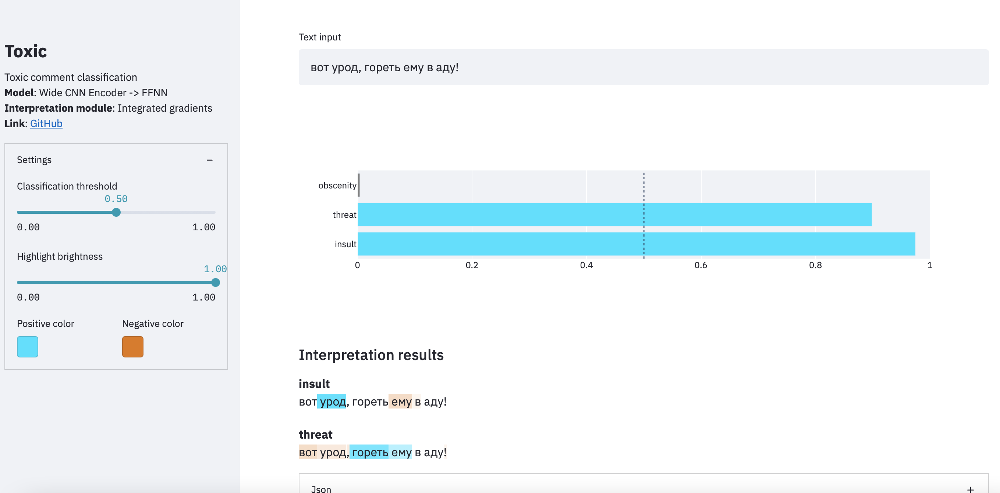

# Toxic Comment Classification
Fullstack end-to-end toxic comment classification with result interpretation

You can visit the online demo on [this](https://share.streamlit.io/esceptico/toxic/ui/app.py) page
## Data
The dataset is available at [kaggle](https://www.kaggle.com/alexandersemiletov/toxic-russian-comments) and contains labelled comments from the popular Russian social network ok.ru

## Train
```
python run_training.py
```

## Inference
```python
from src.toxic.inference import Toxic

model = Toxic.from_checkpoint('path_to_model_or_name')
model.infer('привет, придурок')
```

Result:
```
{
    'predicted': [
        {'class': 'insult', 'confidence': 0.99324},
        {'class': 'threat', 'confidence': 0.002},
        {'class': 'obscenity', 'confidence': 0.00225}
    ],
    'interpretation': {
        'spans': [(0, 7), (7, 16)],
        'weights': {
            'insult': [-0.34299, 0.93934],
            'threat': [-0.97362, 0.22819],
            'obscenity': [-0.99579, 0.09168]
        }
    }
}
```

### Pretrained model

We provide pretrained model at release page

To download the model execute:
```
wget https://github.com/esceptico/toxic/releases/download/v0.1.0/model.pth.zip
unzip model.pth.zip
```

You can download and cache pretrained model by model name as well:
```python
model = Toxic.from_checkpoint('cnn')
```

**List of supported pretrained models**:
* `cnn`: Wide CNN encoder with Feed Forward classification head


## Serving
### Streamlit
```
streamlit run ui/app.py -- --model=models/model.pth
```


## Powered By
* [captum](https://github.com/pytorch/captum)
* [hydra](https://github.com/facebookresearch/hydra)
* [tokenizers](https://github.com/huggingface/tokenizers)
* [torchmetrics](https://github.com/PyTorchLightning/metrics) 
* [streamlit](https://github.com/streamlit/streamlit)

## License
The code is released under MIT license.

The models are distributed under [CC BY-NC-SA 4.0](https://creativecommons.org/licenses/by-nc-sa/4.0/) according to the dataset license.